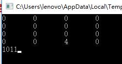
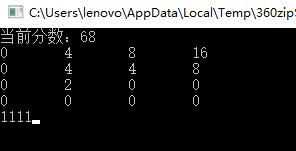

# Game2048 Information

## Prerequisites
    
1. No special fundermental prerequisites instead;
2. Visual C++ runtime enviorment, no special need for C++11 version or higher.

***

## Installing

Simply extract to anywhere u want, no need to register or install specially. The game runs in Windows' cmd directly.

***

## Starting Game

1. Open the file named '***2048.exe***' or  '***main.exe***' to enter the game. 

2. ### Operation

* **Move up**:'***W***'
* **Move down**:'***S***'
* **Move left**:'***A***'
* **Move right**:'***D***'

3. To restart if u want or game is over, close the game and open again.

4. Game rules are the same as usual 2048 games.

***

## Game Interface 

1. Entering the game

#### Tips:
The numbers at the bottom refer to whether you can execute '***W***', '***S***', '***A***', '***D***' movement, when number '***1***' represents available.

2. Runtime

***

## Testing

Any C++ compiling software is able to debugging this game.

***

## Contributing

***Qiu wenjie***, class 1606, CEEE

***

## Author

Also ***Qiu wenjie***, class 1606, CEEE

***

## Version

* V1.000 (already released)
* V1.001 (using Unity2D to optimize the interface, not released)

***

